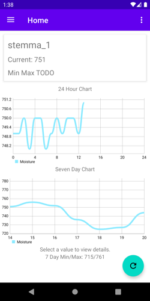

# IOTGarden
This Android, Python, and Raspberry-Pi project is meant to provide a visualization of household or outdoor soil moisture and temperature levels. 
This is a work in progress. 

 

**Requirements**
---
This app WILL NOT WORK without setting up a firebase account and linking it to the app. 
[Android Studio](https://developer.android.com/studio)
[Firebase Realtime Database](https://firebase.google.com/) 
Optional: [Adafruit IO Account](https://io.adafruit.com/) 
[Raspberry Pi](https://www.raspberrypi.org/products/raspberry-pi-4-model-b/) (Any type) 
[Pyrebase](https://github.com/thisbejim/Pyrebase) on your Raspberry Pi  
[Stemma Soil Sensor](https://www.adafruit.com/product/4026)  
[JST I2C Cable](https://www.adafruit.com/product/3955)  

**Instructions**
---
1. Set up your raspberry pi with pyrebase and connect your stemma device.
2. Set up your firebase realtime database.
3. Clone this repository into the directory of your choice.
4. Open the repo in android studio and link your firebase to the application.
5. The python scripts in the root directory of the repo (stemmaAIO.py and stemmaFirebase.py) should be placed somewhere on the reaspberry pi.
6. Set up the scripts with your Adafruit IO (optional) and your firebase accounts.
7. Set up crontab:
 ~~~
 - Open crontab with "sudo crontab -e"
 - For my stemmaAIO.py I run it every minute with this crontab line:
~~~
<code>* * * * * python3 ~/Documents/Stemma/stemmaAIO.py >> ~/Documents/Stemma/AIOlog.txt 2>&1</code>
~~~
- For my stemmaFirebase.py I run it every hour on the hour:
~~~
<code>0 * * * * python3 ~/Documents/Stemma/stemmaFirebase.py >> ~/Documents/Stemma/Firebaselog.txt 2>&1</code>
~~~
- For more info on crontab look at its documentation
- These crontab lines run the script and output any errors into separate log files.
~~~
8. The firebase script is set to delay for 5 seconds on purpose in order to avoid simultaneous IO reading errors.
9. You are now uploading stemma information to Arduino IO and Firebase.
10. The java programming on the Android side of things is set up to give a baseline of moisture levels over 7 days.
11. Wait for the stemma data to come in over time to get a better idea of how the moisture and temperature levels fluctuate in your particular plant and soil.
12. Check out my dashboard and feeds on Adafruit IO for an example: [Dashboard](https://io.adafruit.com/EasyEdo/dashboards/stemma), [Moisture](https://io.adafruit.com/EasyEdo/feeds/stemma.moisture), [Temperature](https://io.adafruit.com/EasyEdo/feeds/stemma.temperature)]. An example for the firbase side can be seen in the progress image above.

**To Do**
---
- [x] 24 Hour Chart
- [x] Seven Day Chart
- [x] Add more instructions to Readme
- [ ] Multiple Stemma connections with multiplexer
- [x] Cards for each Stemma connection
- [ ] Renaming of Stemma connections
- [ ] Plant type suggestions
- [ ] UI updates
- [ ] Refactor HomeFragment
- [ ] Create classes for chart generation
