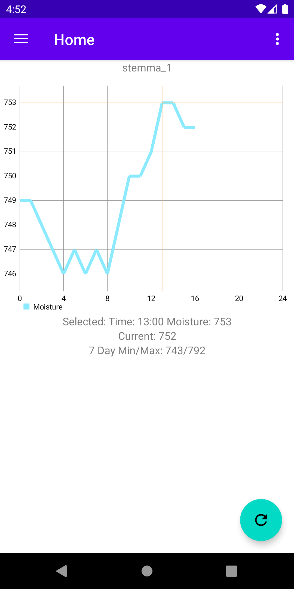

# IOTGarden
This Android project is meant to provide a visualization of household or outdoor soil moisture levels. 
This is a work in progress. 

 

**Requirements**
---

This app WILL NOT WORK without setting up a firebase account and linking it to the app. 
[Firebase Realtime Database](https://firebase.google.com/) 
[Raspberry Pi](https://www.raspberrypi.org/products/raspberry-pi-4-model-b/) (Any type) 
[Pyrebase](https://github.com/thisbejim/Pyrebase) on your Raspberry Pi  
[Stemma Soil Sensor](https://www.adafruit.com/product/4026)  
[JST I2C Cable](https://www.adafruit.com/product/3955)  

**To Do**
---
- [x] 24 Hour Chart
- [x] Seven Day Chart
- [ ] Add more instructions to Readme
- [ ] Multiple Stemma connections with multiplexer
- [ ] Cards for each Stemma connection
- [ ] Renaming of Stemma connections
- [ ] Plant type suggestions
- [ ] UI updates
- [ ] Refactor HomeFragment
- [ ] Create classes for chart generation
